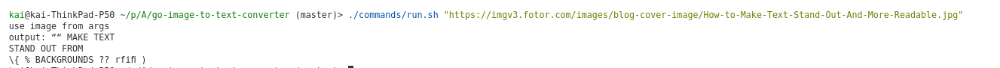

# Image-to-Text Converter Module

This is a Golang module for converting images to text. The module uses OCR (Optical Character Recognition) techniques to extract text from images efficiently.

## Features
- Extract text from images in various formats (e.g., PNG, JPEG).
- Built with Docker for easy setup and deployment.

## Prerequisites
- Docker installed on your machine.

## Installation

1. Clone this repository:
   ```bash
   git clone <repository_url>
   cd <repository_directory>
   ```

2. Build the Docker image:
   ```bash
   ./commands/build.sh
   ```

## Usage
2. Execute the module with your input image:
   ```bash
   ./commands/run.sh <uri_to_image>
   ```

Replace `<uri_to_image>` with the path to your input image.

## Example

```bash
./commands/run.sh https://imgv3.fotor.com/images/blog-cover-image/How-to-Make-Text-Stand-Out-And-More-Readable.jpg
```

Expected output:
```
output: Extract text
```

 --->
 

## Notes
- Ensure the input image is accessible inside the container. Use volume mounting (`-v`) if needed.

## License
This project is licensed under the MIT License.
